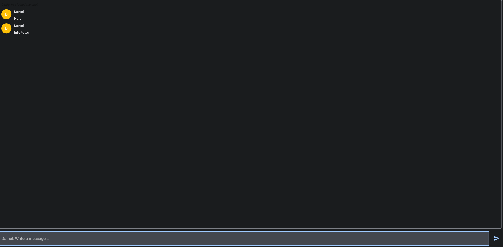

# Multi Realm Chat

## Start Project

Setup Environmnet

Linux

```bash
git clone https://github.com/danielcristho/multi-realm-chat.git && cd multi-realm-chat
python3 -m venv .venv
source env/bin/activate
```

Windows

```bash
git clone https://github.com/danielcristho/multi-realm-chat.git && cd multi-realm-chat
python -m .venv
.venv\Scripts\activate
```

Install requirements

```bash
pip install -r requirements.txt
```

Install MPV

Linux

```bash
sudo apt install libmpv-dev mpv
```

Windows

Install from the official website [MVP](https://mpv.io)

## Run UI

```bash
cd ui
```

```bash
flet run
```

Run using browser

```bash
flet run --web ui
```

Jika di direktori `ui`

```bash
flet run --web .
```

Tampilan



